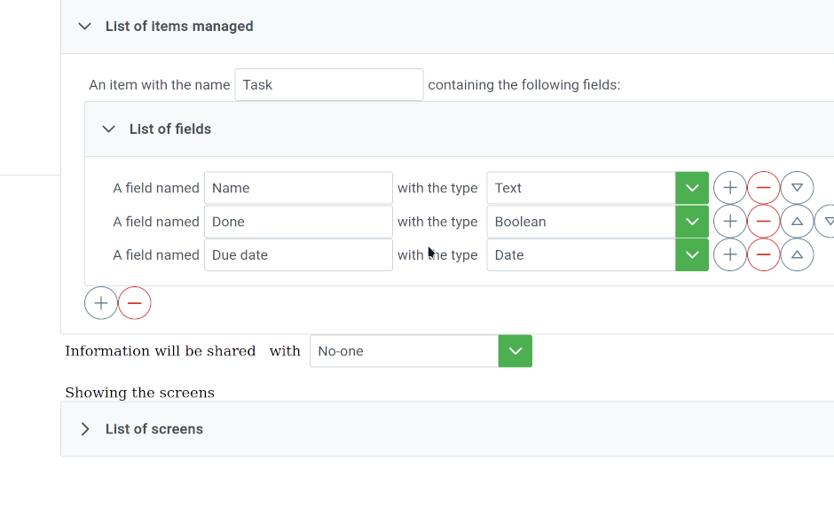
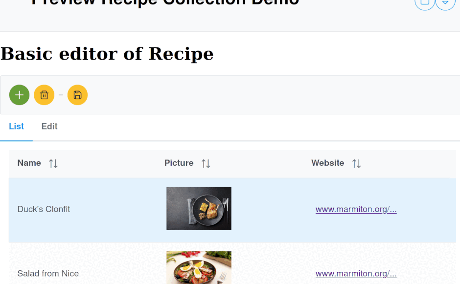

<!--
Nota bene : ce README est automatiquement généré par <https://github.com/YunoHost/apps/tree/master/tools/readme_generator>
Il NE doit PAS être modifié à la main.
-->

# Dont-code Services pour YunoHost

[](https://ci-apps.yunohost.org/ci/apps/dont-code/)  

[](https://install-app.yunohost.org/?app=dont-code)

*[Lire le README dans d'autres langues.](./ALL_README.md)*

> *Ce package vous permet d’installer Dont-code Services rapidement et simplement sur un serveur YunoHost.*  
> *Si vous n’avez pas YunoHost, consultez [ce guide](https://yunohost.org/install) pour savoir comment l’installer et en profiter.*

## Vue d’ensemble

Dont-code is a low-code / no-code platform letting user create their own applications based on complete feature sets developed by IT.
You can find more information here: https://dont-code.net

This Yunohost app installs the server part (services + mongo database) needed to run the dont-code applications.

### Features

- Thanks to the Powerful [Builders](https://dont-code.net/ide-ui) and [Previewers](https://dont-code.net/ide-ui), a user can directly design its application and immediately see the result
- One only needs to describe its application by filling sentences prepared by the platform.
- By default it provides support for images, currency, text, numbers, countries, links.
- Multiple plugins allow you to list, edit, make reports, call services, save to database, save in browser, and so on...
- Plugins can be developed by any IT team
- Projects and all user's data are backed up as part of the Yunohost backup process
- As well any documents or images uploaded by users will be backed up


**Version incluse :** 0.3.2~ynh8

**Démo :** <https://dont-code.net/apps.html>

## Captures d’écran




## Documentations et ressources

- Site officiel de l’app : <https://dont-code.net>
- Documentation officielle utilisateur : <https://dont-code.net/news.html>
- Documentation officielle de l’admin : <https://dont-code.net/developers.html>
- Dépôt de code officiel de l’app : <https://github.com/dont-code>
- YunoHost Store : <https://apps.yunohost.org/app/dont-code>
- Signaler un bug : <https://github.com/YunoHost-Apps/dont-code_ynh/issues>

## Informations pour les développeurs

Merci de faire vos pull request sur la [branche `testing`](https://github.com/YunoHost-Apps/dont-code_ynh/tree/testing).

Pour essayer la branche `testing`, procédez comme suit :

```bash
sudo yunohost app install https://github.com/YunoHost-Apps/dont-code_ynh/tree/testing --debug
ou
sudo yunohost app upgrade dont-code -u https://github.com/YunoHost-Apps/dont-code_ynh/tree/testing --debug
```

**Plus d’infos sur le packaging d’applications :** <https://yunohost.org/packaging_apps>
